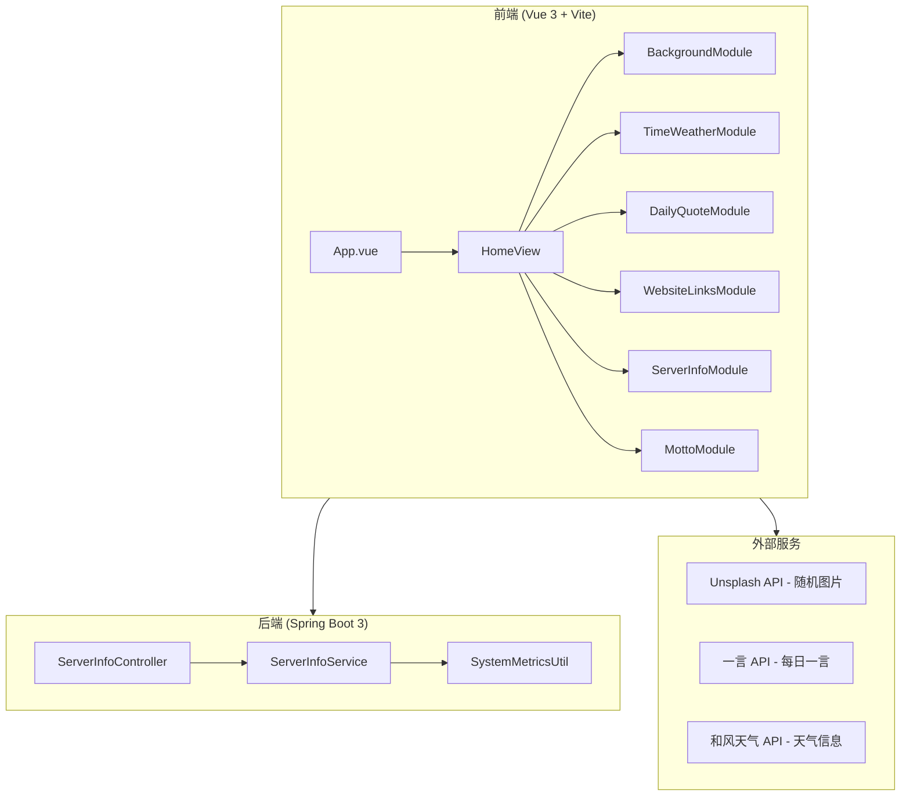

# 个人导航首页 - 项目设计文档

## 1. 系统架构



## 2. 模块设计

### 2.1 前端模块

| 模块 | 功能 | 数据来源 |
|------|------|----------|
| BackgroundModule | 随机图片背景 + 磨砂玻璃效果 | Unsplash API / 本地配置 |
| TimeWeatherModule | 时间/日期/天气/位置 | 系统时间 + 和风天气API |
| DailyQuoteModule | 每日一言 | 一言API (hitokoto.cn) |
| WebsiteLinksModule | 网站导航链接 | 本地配置文件 |
| ServerInfoModule | 服务器信息监控 | 后端API |
| MottoModule | 展示话术文案 | 本地配置文件 |

### 2.2 后端模块

| 模块 | 功能 |
|------|------|
| ServerInfoController | 提供服务器信息API |
| ServerInfoService | 获取系统指标 |
| SystemMetricsUtil | 系统信息采集工具 |

## 3. API 接口清单

### 3.1 服务器信息接口

| 方法 | 路径 | 描述 |
|------|------|------|
| GET | /api/server/info | 获取服务器综合信息 |
| GET | /api/server/cpu | 获取CPU使用率 |
| GET | /api/server/memory | 获取内存使用情况 |
| GET | /api/server/disk | 获取磁盘使用情况 |
| GET | /api/server/network | 获取网络流量信息 |

## 4. UI/UX 规范

### 4.1 色彩系统

```scss
// 主色调
$primary-color: #667eea;
$primary-gradient: linear-gradient(135deg, #667eea 0%, #764ba2 100%);

// 背景色
$glass-bg: rgba(255, 255, 255, 0.15);
$glass-border: rgba(255, 255, 255, 0.2);

// 文字色
$text-primary: #ffffff;
$text-secondary: rgba(255, 255, 255, 0.8);
$text-muted: rgba(255, 255, 255, 0.6);

// 阴影
$glass-shadow: 0 8px 32px rgba(0, 0, 0, 0.1);
```

### 4.2 磨砂玻璃效果

```scss
.glass-card {
  background: rgba(255, 255, 255, 0.15);
  backdrop-filter: blur(20px);
  -webkit-backdrop-filter: blur(20px);
  border: 1px solid rgba(255, 255, 255, 0.2);
  border-radius: 16px;
  box-shadow: 0 8px 32px rgba(0, 0, 0, 0.1);
}
```

### 4.3 间距规范

- 基础单位: 8px
- 卡片内边距: 24px
- 模块间距: 24px
- 元素间距: 16px

### 4.4 字体规范

- 主标题: 2rem, font-weight: 700
- 副标题: 1.25rem, font-weight: 600
- 正文: 1rem, font-weight: 400
- 小字: 0.875rem, font-weight: 400

### 4.5 动画规范

- 过渡时长: 0.3s
- 缓动函数: cubic-bezier(0.4, 0, 0.2, 1)
- Hover 缩放: scale(1.02)
- 入场动画: fadeInUp

## 5. 响应式断点

| 断点 | 宽度 | 布局 |
|------|------|------|
| Mobile | < 768px | 单列布局 |
| Tablet | 768px - 1024px | 双列布局 |
| Desktop | > 1024px | 多列网格布局 |

## 6. 配置文件结构

```javascript
// config/app.config.js
export default {
  // 背景图片配置
  background: {
    type: 'unsplash', // 'unsplash' | 'bing' | 'local'
    unsplashAccessKey: '',
    localImages: [],
    refreshInterval: 3600000 // 1小时
  },
  
  // 天气配置
  weather: {
    apiKey: '',
    defaultCity: '北京',
    unit: 'metric'
  },
  
  // 网站链接配置
  websites: [
    { name: 'Google', url: 'https://google.com', icon: 'search' }
  ],
  
  // 话术文案配置
  mottos: [
    '代码改变世界',
    '保持学习，保持进步'
  ],
  
  // 服务器信息配置
  serverInfo: {
    enabled: true,
    refreshInterval: 5000
  }
}
```
